testing ZTR test with curation to see the behavior

# Zero-Touch Remediation (ZTR) + Curation Compliant Version Selection (CVS)

**Question:** A Maven package is not in the Artifactory cache, so Artifactory fetches it from the public
registry. The version has a vulnerability and Chainguard offers a patched build. The virtual repo has ZTR
enabled and Curation policies enforced with Compliant Version Selection on. Which one wins: the
Curation-compliant version, or the Chainguard patch?

## Short answer

They are two separate mechanisms that both end in a version swap, and the docs do **not** state which one
runs first. What the docs do say:

- **Curation is the gate.** The ZTR overview says *"Blocking enforcement remains part of Xray and Curation."*
  ZTR does not bypass it.
- **A patch is not exempt from Curation.** JFrog describes remediated versions as abiding by the active
  Curation policies (see the note under *Sources*). A Chainguard patch that violates a policy (e.g. an
  immaturity or license policy) should not be served.
- **They answer different questions.**
  - CVS runs when a *Curation policy blocks the requested version*. It serves the highest version that passes
    every active policy.
  - ZTR runs on download from a covered virtual repo when the requested version has CVEs and a *less
    vulnerable patched version* exists. It serves the patch **at the originally requested coordinate**.
- **Which fires depends on your policies.** If no Curation policy blocks the vulnerable version, CVS never
  triggers and ZTR swaps in the Chainguard patch. If a policy does block it, CVS (or a hard block) applies,
  and the Chainguard patch is only served if it is itself compliant.

## Flow (as documented, ordering inferred)

```mermaid
flowchart TD
    A[Build requests group:artifact:version<br/>from virtual repo] --> B{In Artifactory cache?}
    B -- yes --> D
    B -- no --> C[Fetch from public registry<br/>via remote repo]
    C --> D{Curation policies on the version<br/>block it?}
    D -- no --> E{ZTR automation covers this virtual repo<br/>and a less-vulnerable patch exists?}
    D -- yes --> F{CVS enabled and<br/>version range, not locked?}
    F -- yes --> G[Curation picks highest version<br/>passing ALL active policies]
    F -- "no (locked version)" --> H[Request fails: 403<br/>no fallback attempted]
    G --> I([Serve compliant version<br/>audit log records original + delivered])
    E -- no --> J([Serve original version])
    E -- yes --> K{Patched candidate<br/>passes Curation policies?}
    K -- yes --> L([Serve Chainguard patch at the<br/>originally requested coordinate])
    K -- no --> M([Patch not served<br/>original or block applies])
```

The position of the ZTR box relative to the Curation box is the part I could not confirm from the docs.
Treat the diagram's ordering as the expected behavior to verify, not a documented guarantee.

## Things that affect the outcome

| Factor | Effect |
|---|---|
| **Locked / pinned versions** | CVS: *"If a developer requests a specific, locked version that is blocked by policy, the request fails (no fallback is attempted for locked versions)."* Maven `pom.xml` versions are usually exactly this case, so expect 403s rather than a fallback. |
| **Chainguard coverage** | *"Chainguard provides Maven fixes only."* The Chainguard remote repo must be a member of the covered virtual repo. |
| **Patch selection** | ZTR uses the *Least Vulnerable* strategy (Critical x 1,000,000 + High x 10,000 + Medium x 100 + Low). Ties go to local patches, then vendor rebuilds, then your configured vendor priority. |
| **No useful patch** | If no suitable version exists or the patch would not reduce CVE exposure, the original artifact is served. |
| **Xray indexing** | ZTR needs Xray-indexed remote repos behind the virtual repo. |

## How to confirm the actual precedence on this repo

Use a dependency that has a Chainguard patch and a known CVE, then try each combination against
`maven-ztr-virtual-rose`:

1. ZTR on, **no** Curation policy blocking the version. Expect the Chainguard patch.
2. ZTR on, a Curation vulnerability policy that blocks the version, CVS **on**, version **not** locked.
   Expect the highest compliant version, or the patch if it is compliant. Note which one you get.
3. Same as 2 with the version **locked** in the `pom.xml`. Expect a 403 per the CVS docs.
4. Same as 2 with a policy the Chainguard patch violates (e.g. immaturity). Expect the patch not served.

For each: check the Curation audit log (original request vs delivered version) and the Xray scan status
(*Patched*) to see which mechanism acted.

## Sources

- [Zero-Touch Remediation Overview](https://docs.jfrog.com/security/docs/zero-touch-remediation-overview)
- [Zero-Touch Remediation Release Notes](https://docs.jfrog.com/releases/docs/zero-touch-remediation)
- [Compliant Version Selection](https://docs.jfrog.com/security/docs/compliant-version-selection)
- [Fallback Behavior for Blocked Packages](https://docs.jfrog.com/security/docs/fallback-behavior-for-blocked-packages)
- [JFrog Zero-Touch Remediation](https://jfrog.com/zero-touch-remediation/) (describes a policy-governed "Compliant Version Replacement")

Note: the "remediated versions abide by all of your active Curation policies" wording came from a search
summary of JFrog's ZTR material. I could not locate that sentence verbatim on the pages above, so confirm
it with the experiment before relying on it.
