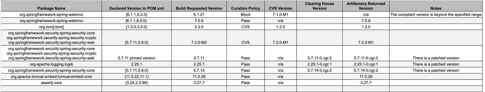

testing ZTR test with curation to see the behavior

# Zero-Touch Remediation (ZTR) + Curation Compliant Version Selection (CVS)

> **Note:** this setup has Zero-Touch Remediation turned on for the virtual repo `maven-ztr-virtual-rose`.

When a Maven virtual repo has both Zero-Touch Remediation (ZTR) and Curation Compliant Version Selection (CVS)
enabled, they act as two separate mechanisms that can each end in a version swap, and they are able to work in
conjunction: Curation CVS keeps the version policy-compliant, while ZTR can serve a patched build from a Clearing House.

- **Curation is the gate.** The ZTR overview says *"Blocking enforcement remains part of Xray and Curation."*
  ZTR does not bypass it.
- **A patch is not exempt from Curation.** JFrog describes remediated versions as abiding by the active
  Curation policies (see the note under *Sources*). A Chainguard patch that violates a policy (e.g. an
  immaturity or license policy) should not be served.
- **They answer different questions.**
  - CVS runs when a *Curation policy blocks the requested version*. It serves the highest version that passes
    every active policy.
  - ZTR runs on download from a covered virtual repo when the requested version has CVEs and a *less
    vulnerable patched version* exists. It serves the patch **at the originally requested coordinate**.
- **Which fires depends on your policies.** If no Curation policy blocks the vulnerable version, CVS never
  triggers and ZTR swaps in the Chainguard patch. If a policy does block it, CVS (or a hard block) applies,
  and the Chainguard patch is only served if it is itself compliant.

## Tested scenarios and observed behavior

**Common setup:**

- Virtual repo: `maven-ztr-virtual-rose` on `solenglatest`
- Members: `maven-local`, `maven-central-remote-rose` and `chainguard-java`
- Curation: Compliant Version Selection (CVS) on, with multiple policies enforced
- Zero-Touch Remediation (ZTR): enabled
- Build: GitHub Actions with `jf mvn`

### Scenario 1: a policy blocks the version and a compliant version exists

- Blocked versions were replaced by a compliant version within the requested range, and the build succeeded.

### Scenario 2: a policy blocks and no compliant version exists

- The download was blocked with a 403 and there was no fallback, because the compliant version was beyond the
  requested range.

### Scenario 3: no policy blocks and a Chainguard build exists

- The plain pinned coordinates were served as the Chainguard build (`-0.cgr.N`) from `chainguard-java-cache`, not
  the Maven Central bytes.

### Results table

## Notes

- **Locked versions don't fall back.** Maven versions pinned in a `pom.xml` fail outright when blocked; ranges are required for CVS.
- **Ranges make builds non-reproducible**, and can resolve pre-releases (for example `httpclient5` `5.7-alpha1`). They are used here for testing only.
- **Not confirmed:** ordering between ZTR and Curation, and whether a remediated version is re-checked against Curation.
  The ZTR automation config could not be inspected from the CLI.

## Sources

- [Zero-Touch Remediation Overview](https://docs.jfrog.com/security/docs/zero-touch-remediation-overview)
- [Zero-Touch Remediation Release Notes](https://docs.jfrog.com/releases/docs/zero-touch-remediation)
- [Compliant Version Selection](https://docs.jfrog.com/security/docs/compliant-version-selection)
- [Fallback Behavior for Blocked Packages](https://docs.jfrog.com/security/docs/fallback-behavior-for-blocked-packages)
- [JFrog Zero-Touch Remediation](https://jfrog.com/zero-touch-remediation/) (describes a policy-governed "Compliant Version Replacement")

Note: the "remediated versions abide by all of your active Curation policies" wording came from a search
summary of JFrog's ZTR material. I could not locate that sentence verbatim on the pages above, so confirm
it with the experiment before relying on it.
