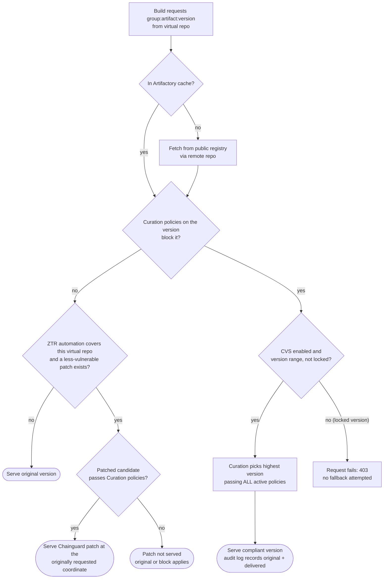

testing ZTR test with curation to see the behavior

# Zero-Touch Remediation (ZTR) + Curation Compliant Version Selection (CVS)

**Question:** A Maven package is not in the Artifactory cache, so Artifactory fetches it from the public
registry. The version has a vulnerability and Chainguard offers a patched build. The virtual repo has ZTR
enabled and Curation policies enforced with Compliant Version Selection on. Which one wins: the
Curation-compliant version, or the Chainguard patch?

## Short answer

They are two separate mechanisms that both end in a version swap, and the docs do **not** state which one
runs first. What the docs do say:

- **Curation is the gate.** The ZTR overview says *"Blocking enforcement remains part of Xray and Curation."*
  ZTR does not bypass it.
- **A patch is not exempt from Curation.** JFrog describes remediated versions as abiding by the active
  Curation policies (see the note under *Sources*). A Chainguard patch that violates a policy (e.g. an
  immaturity or license policy) should not be served.
- **They answer different questions.**
  - CVS runs when a *Curation policy blocks the requested version*. It serves the highest version that passes
    every active policy.
  - ZTR runs on download from a covered virtual repo when the requested version has CVEs and a *less
    vulnerable patched version* exists. It serves the patch **at the originally requested coordinate**.
- **Which fires depends on your policies.** If no Curation policy blocks the vulnerable version, CVS never
  triggers and ZTR swaps in the Chainguard patch. If a policy does block it, CVS (or a hard block) applies,
  and the Chainguard patch is only served if it is itself compliant.

## Flow (as documented, ordering inferred)

The position of the ZTR box relative to the Curation box is the part I could not confirm from the docs.
Treat the diagram's ordering as the expected behavior to verify, not a documented guarantee.

## Things that affect the outcome

| Factor | Effect |
|---|---|
| **Locked / pinned versions** | CVS: *"If a developer requests a specific, locked version that is blocked by policy, the request fails (no fallback is attempted for locked versions)."* Maven `pom.xml` versions are usually exactly this case, so expect 403s rather than a fallback. |
| **Chainguard coverage** | *"Chainguard provides Maven fixes only."* The Chainguard remote repo must be a member of the covered virtual repo. |
| **Patch selection** | ZTR uses the *Least Vulnerable* strategy (Critical x 1,000,000 + High x 10,000 + Medium x 100 + Low). Ties go to local patches, then vendor rebuilds, then your configured vendor priority. |
| **No useful patch** | If no suitable version exists or the patch would not reduce CVE exposure, the original artifact is served. |
| **Xray indexing** | ZTR needs Xray-indexed remote repos behind the virtual repo. |

## Tested scenarios and observed behavior

Tested on `feature/ztr-with-curation-policy-test` against `maven-ztr-virtual-rose` (members: `maven-local`,
`maven-central-remote-rose`, `chainguard-java`) with the Curation policy `rose-ztr-curation-test`
(blocks CVEs with CVSS 9 or above).

### Scenario 1: policy blocks the requested version, a compliant version exists

- **Setup:** dependencies declared as version ranges instead of exact pins.
- **Observed:** blocked versions were replaced by a compliant one in range: `tomcat-embed-core` `10.1.16` -> `10.1.60`,
  `assertj-core` `3.24.2` -> `3.27.7`, `spring-webmvc` -> `7.x` once the range allowed it.
- **Takeaway:** consistent with Compliant Version Selection returning a compliant version. A swap to a Chainguard
  patch on top of the selected version was **not** observed.

### Scenario 2: policy blocks the version, no compliant version exists

- **Setup:** `spring-webmvc` range `[6.1.1,6.2.0)`. Every `6.1.x` has CVSS 9.8 CVEs (`CVE-2026-59313`, `CVE-2026-47884`), fixed only in `7.0.9`.
- **Observed:** the download was blocked (HTTP 403, Curation event "Download Blocked" by `rose-ztr-curation-test`). No fallback.
- **Takeaway:** CVS only chooses from versions inside the requested range. With none compliant, the request fails.
  Widening the range to include `7.x` (and moving to Spring Boot 4 / Spring Framework 7.0.9) fixed it.
  Whether ZTR stays out of the picture here was not tested.

### Scenario 3: no policy blocks the version, a Chainguard build exists

- **Setup:** exact pins on `log4j-core` `2.25.1` and `spring-security-*` `5.7.11`.
- **Observed:** the plain coordinates resolved without a block, and the virtual repo served the Chainguard copy
  (`chainguard-java-cache`), not the Maven Central bytes. Xray's build scan identified `log4j-core` as `2.25.1-0.cgr.1`.
- **Takeaway:** the package is served as a Chainguard build at the originally requested coordinate. The vulnerability
  count matched the original (4 issues on `log4j-core`), so this showed the Chainguard build, not a fix-bearing patch.

## Notes

- **Locked versions don't fall back.** Maven versions pinned in a `pom.xml` fail outright when blocked; ranges are required for CVS.
- **Ranges make builds non-reproducible**, and can resolve pre-releases (for example `httpclient5` `5.7-alpha1`). They are used here for testing only.
- **Not confirmed:** ordering between ZTR and Curation, and whether a remediated version is re-checked against Curation.
  The ZTR automation config could not be inspected from the CLI.

## Sources

- [Zero-Touch Remediation Overview](https://docs.jfrog.com/security/docs/zero-touch-remediation-overview)
- [Zero-Touch Remediation Release Notes](https://docs.jfrog.com/releases/docs/zero-touch-remediation)
- [Compliant Version Selection](https://docs.jfrog.com/security/docs/compliant-version-selection)
- [Fallback Behavior for Blocked Packages](https://docs.jfrog.com/security/docs/fallback-behavior-for-blocked-packages)
- [JFrog Zero-Touch Remediation](https://jfrog.com/zero-touch-remediation/) (describes a policy-governed "Compliant Version Replacement")

Note: the "remediated versions abide by all of your active Curation policies" wording came from a search
summary of JFrog's ZTR material. I could not locate that sentence verbatim on the pages above, so confirm
it with the experiment before relying on it.
